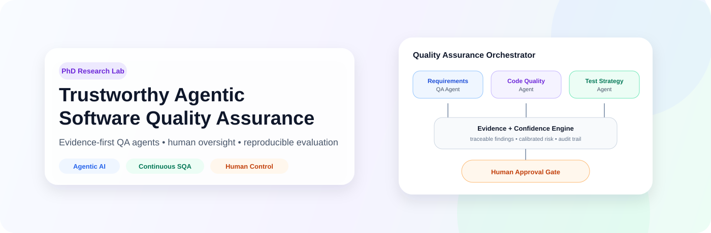
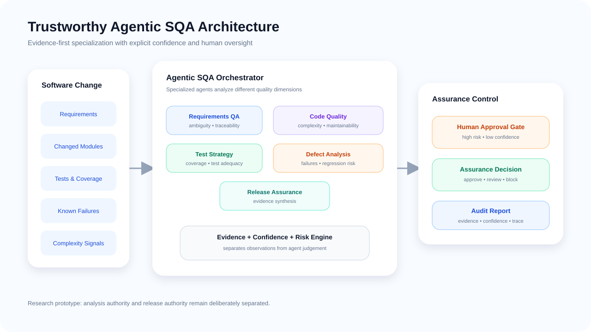
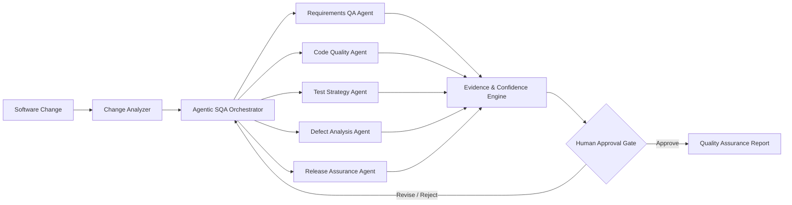
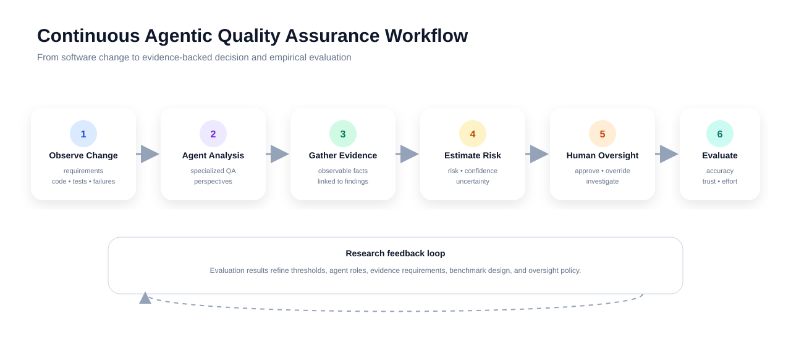
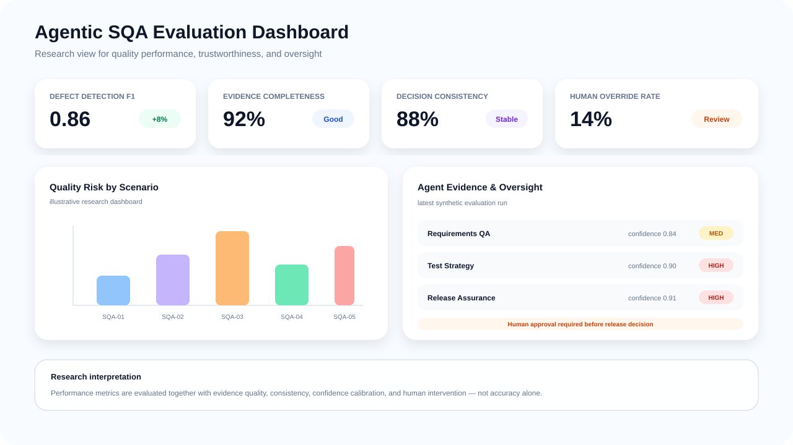

<p align="center">
  
</p>

<h1 align="center">Trustworthy Agentic Software Quality Assurance</h1>

<p align="center">
  <b>A PhD-oriented research framework for trustworthy agentic AI in continuous software quality assurance.</b>
</p>

<p align="center">
  
  
  
  
  
</p>

---

## Overview

**Trustworthy Agentic Software Quality Assurance** is an academic software-engineering research prototype for studying how autonomous AI agents can support continuous software quality assurance while remaining explainable, auditable, evidence-driven, and under meaningful human control.

The project focuses on multi-agent quality analysis, software risk assessment, test reasoning, defect evidence, release readiness, human approval gates, and reproducible benchmarking. It is intentionally designed as a research scaffold rather than a production release-management system.

---

## Research Motivation

Modern software delivery produces more changes, tests, dependencies, and operational evidence than human reviewers can consistently inspect at release speed. AI agents may help by coordinating quality tasks, but autonomous quality decisions also introduce new failure modes: unsupported recommendations, inconsistent test selection, opaque risk scoring, overconfident release approvals, and weak accountability.

This project studies how agentic AI can improve quality assurance **without turning quality gates into unreviewable automation**.

---

## Core Research Question

> **How can agentic AI be designed and empirically evaluated to improve continuous software quality assurance while preserving evidence traceability, calibrated uncertainty, decision reliability, and meaningful human control?**

The detailed PhD positioning, research gaps, refined research questions, falsifiable hypotheses, and expected contributions are documented in [`docs/research-gap.md`](docs/research-gap.md).

---

## Research Contributions

| Contribution | Goal |
|---|---|
| Agentic SQA architecture | Coordinate specialized software quality agents through a transparent orchestrator. |
| Evidence-first decision model | Require recommendations to reference observable quality evidence. |
| Human approval gates | Escalate high-risk or low-confidence release decisions for human review. |
| QA reliability metrics | Measure consistency, calibration, under-calls, evidence support, and decision stability. |
| Benchmark scenarios | Provide controlled synthetic software-quality cases for reproducible experiments. |
| Baseline comparison | Compare agentic SQA with a deterministic rule-based quality baseline. |
| Evaluation protocol | Support single-agent, multi-agent, and human-oversight experimental conditions. |
| Assurance-drift analysis | Study whether model, prompt, policy, or orchestration changes alter QA behavior over time. |

---

## System Architecture

<p align="center">
  
</p>



---

## Continuous Quality Workflow

<p align="center">
  
</p>

| Stage | Purpose |
|---|---|
| Observe change | Represent requirements, modified modules, tests, defects, and CI evidence. |
| Analyze quality | Specialized agents assess maintainability, reliability, test adequacy, and release risk. |
| Gather evidence | Findings are tied to explicit observations rather than unsupported conclusions. |
| Estimate confidence | Each recommendation carries a confidence estimate and uncertainty note. |
| Apply oversight | High-risk or uncertain actions require human approval. |
| Evaluate outcome | Compare correctness, consistency, workload, and quality-detection performance. |

---

## Quality Assurance Dashboard Concept

<p align="center">
  
</p>

The dashboard concept tracks defect detection, test coverage evidence, agent agreement, confidence calibration, human overrides, release recommendations, and quality-risk trends.

---

## Agent Roles

| Agent | Research responsibility |
|---|---|
| Requirements QA Agent | Detect ambiguity, incompleteness, unverifiable acceptance criteria, and traceability gaps. |
| Code Quality Agent | Assess maintainability, complexity signals, change concentration, and review risk. |
| Test Strategy Agent | Recommend test depth and identify weak or missing verification evidence. |
| Defect Analysis Agent | Aggregate known failure evidence and estimate defect-related release risk. |
| Release Assurance Agent | Synthesize evidence into an explainable release recommendation. |

---

## Trustworthiness Model

Every agent recommendation is represented using four elements:

```text
Finding
  + Evidence
  + Confidence
  + Oversight requirement
```

The framework deliberately separates **observed evidence** from **agent judgement** and **analysis** from **decision authority**. High-impact recommendations can be configured to require explicit human approval.

---

## Experimental Conditions

The repository is structured to support comparison of:

| Condition | Purpose |
|---|---|
| Rule-based SQA | Deterministic baseline using explicit thresholds. |
| Single-agent SQA | General-purpose AI baseline. |
| Multi-agent SQA | Specialized quality agents with evidence aggregation. |
| Multi-agent + human oversight | Agentic QA with explicit approval and override points. |

---

## Implemented Evaluation Metrics

The evaluation module now provides research-oriented metrics that distinguish ordinary prediction error from potentially unsafe assurance error:

- exact release-recommendation accuracy;
- **mean ordinal recommendation error** across `approve < review < block`;
- **undercall rate** for predictions that are less conservative than ground truth;
- human-approval-gate precision, recall, and F1;
- mean decision confidence;
- structured evidence coverage across agent findings;
- repeated-run recommendation consistency.

The metric definitions, interpretation guidance, and reporting requirements are documented in [`docs/metrics-specification.md`](docs/metrics-specification.md).

---

## Benchmark Dataset

The controlled benchmark contains multiple software-quality families, including safe changes, requirements ambiguity, test adequacy, test traceability, maintainability, known defects, conflicting evidence, compound risk, and threshold boundary cases.

Each scenario records:

```text
scenario ID
quality family
observable inputs
expected recommendation
expected human-approval gate
ground-truth rationale
```

Dataset-integrity tests verify scenario uniqueness, coverage of multiple quality families, required ground-truth fields, and the presence of approve/review/block cases.

---

## Quick Start

```bash
git clone https://github.com/Hirakhyzer/trustworthy-agentic-software-quality-assurance.git
cd trustworthy-agentic-software-quality-assurance
python -m venv .venv
source .venv/bin/activate  # Windows: .venv\\Scripts\\activate
python -m pip install --upgrade pip
python -m pip install -e ".[dev]"
python examples/run_demo.py
pytest
python benchmarks/run_benchmark.py
```

---

## Repository Structure

```text
trustworthy-agentic-software-quality-assurance/
├── README.md
├── assets/
│   ├── banner.svg
│   ├── agentic-sqa-architecture.svg
│   ├── continuous-quality-workflow.svg
│   └── quality-assurance-dashboard.svg
├── benchmarks/
│   ├── README.md
│   └── run_benchmark.py
├── data/
│   └── scenarios.json
├── docs/
│   ├── research-background.md
│   ├── research-gap.md
│   ├── research-framework.md
│   ├── evaluation-methodology.md
│   ├── metrics-specification.md
│   ├── experimental-protocol.md
│   ├── threats-to-validity.md
│   └── ethical-boundary.md
├── examples/
│   └── run_demo.py
├── src/trustworthy_agentic_sqa/
│   ├── __init__.py
│   ├── schema.py
│   ├── quality_agents.py
│   ├── evidence.py
│   ├── risk_engine.py
│   ├── baselines.py
│   ├── orchestrator.py
│   └── evaluation.py
└── tests/
    ├── test_orchestrator.py
    ├── test_benchmark_dataset.py
    └── test_evaluation_metrics.py
```

---

## Research Boundary

This repository is for software-engineering research and education. It does not autonomously approve real production releases, bypass organizational controls, modify third-party systems, or replace accountable human software-quality roles. Real deployment would require organization-specific validation, security review, access controls, audit requirements, and human responsibility.

---

## Reproducibility

Experiments should record:

- scenario identifier and version;
- agent configuration;
- input evidence;
- recommendation and confidence;
- human decision where applicable;
- baseline result;
- evaluation metrics;
- random seed or deterministic configuration where relevant.

See [`docs/experimental-protocol.md`](docs/experimental-protocol.md), [`docs/metrics-specification.md`](docs/metrics-specification.md), and [`docs/threats-to-validity.md`](docs/threats-to-validity.md) for the research protocol.

---

## License

Released under the [MIT License](LICENSE).

---

## Author

Created by **Hira Khyzer** as a PhD-oriented software quality assurance and trustworthy agentic AI research prototype.
